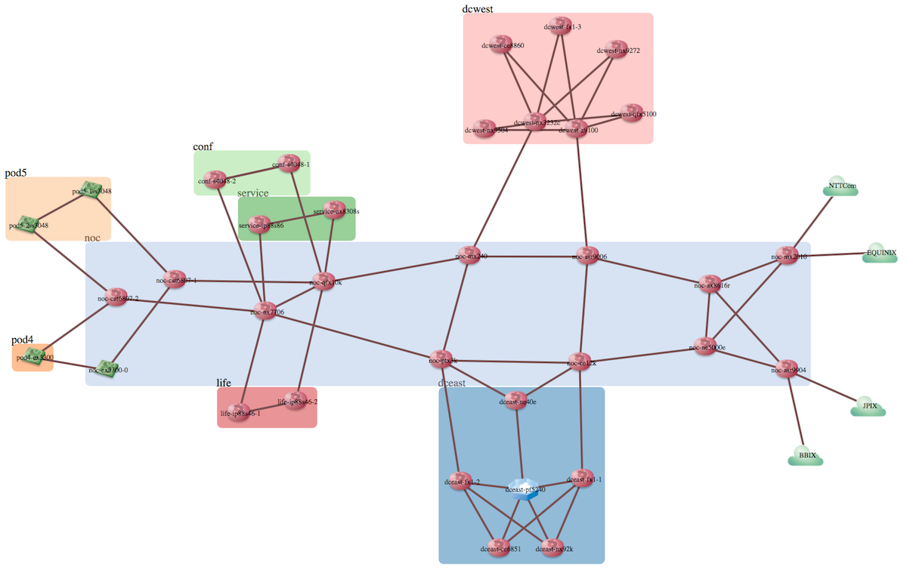
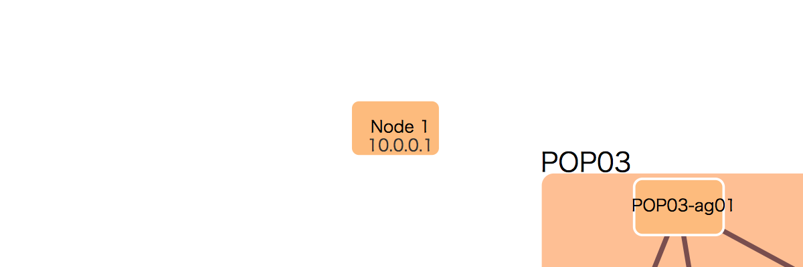
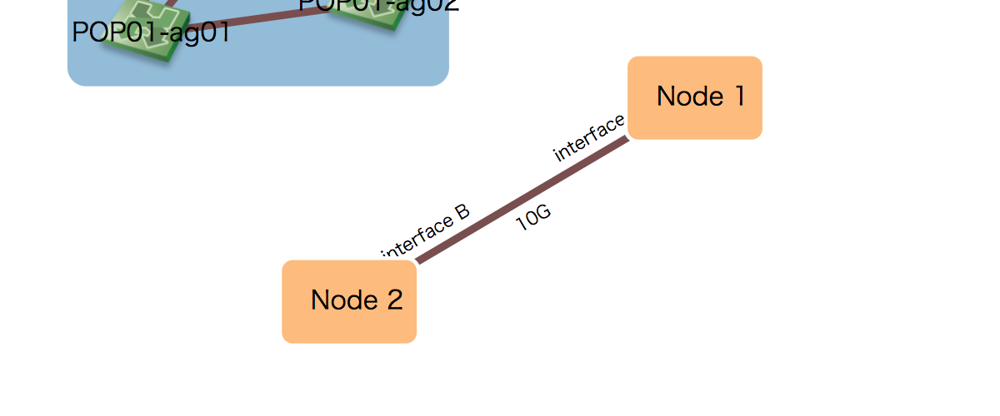
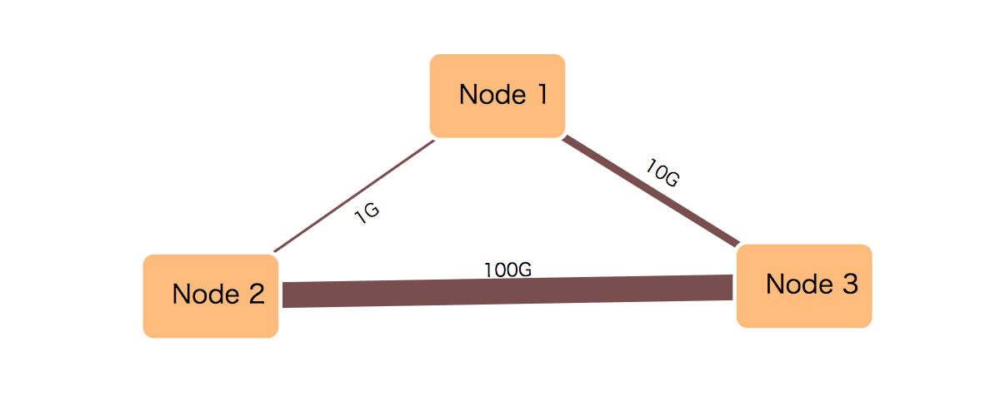
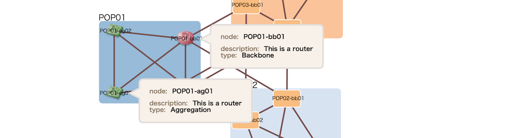

# inet-henge.js

inet-henge.js generates d3.js based Auto Layout Network Diagram from JSON data.  
inet-henge helps you draw it by calculating coordinates automatically, placing nodes and links in SVG format.

Each object is draggable and zoomable.


All you have to do are:

1. Define nodes identified by name
2. Define links by specifying both end nodes
3. Show in a browser. That's it.

JSON example:

```json
{
  "nodes": [
    { "name": "A" },
    { "name": "B" }
  ],

  "links": [
    { "source": "A", "target": "B" }
  ]
}
```

## Getting Started

```zsh
npm install inet-henge

# or

git clone https://github.com/codeout/inet-henge.git
```

Then host the root directory in your favorite web server.

```
ruby -run -e httpd . -p 8000
```

Now you can see ```http://localhost:8000/example```.


```
python -m SimpleHTTPServer  # python2
python -m http.server       # python3

or

php -S 127.0.0.1:8000
```

are also available to start a web server.


## Demo

* [Shownet 2017 Network](https://inet-henge.herokuapp.com/)
* [Shownet 2016 Network](https://inet-henge.herokuapp.com/shownet2016.html)


## Usage

In example [here](example/shownet.html), load related assets at first:

* d3.js v3
* cola.js
  * :warning: **It doesn't support d3.js v4** :warning:
* inet-henge.js

```html
<!DOCTYPE html>
<html>
  <head>
    <meta charset="utf-8" />

    <!-- You can customize a style of network diagram by CSS -->
    <link href="style.css" rel="stylesheet" />

    <script src="https://cdnjs.cloudflare.com/ajax/libs/d3/3.5.17/d3.js"></script>
    <script src="../vendor/cola.min.js"></script>
    <script src="../inet-henge.js"></script>
  </head>
```

define a blank container:


```html
  <body>
    <div id="diagram"></div>
  </body>
```

and render your network diagram:

```html
  <script>
   new Diagram('#diagram', 'shownet.json').init('interface');
  </script>
</html>
```

Object is also acceptable:

```html
  <script>
    const data = {
      "nodes": [{ "name": "A" }, { "name": "B" }],
      "links": [{ "source": "A", "target": "B" }]
    };
   new Diagram('#diagram', data).init('interface');
  </script>
</html>
```

inet-henge.js renders your network diagram as SVG within ```<div id="diagram"></div>```. In the example above the diagram also displays metadata labelled ```'interface'``` which defined in JSON data.




### Node Group

Nodes get rendered in groups when you specify which node belongs to which group by regular expression.

When the first three characters describe POP name, you can group nodes by doing this:

``` javascript
const diagram = new Diagram('#diagram', 'data.json', {pop: /^.{3}/})
```


### JSON Data

Minimal json looks like:

```json
{
  "nodes": [
    { "name": "A" },
    { "name": "B" }
  ],

  "links": [
    { "source": "A", "target": "B" }
  ]
}
```

You can specify node icon by URL:

```json
  "nodes": [
    { "name": "dceast-ne40e", "icon": "./images/router.png" }
  ]
```

Metadata to display on network diagrams:

```js
new Diagram('#diagram', 'index.json').init('interface');
```

```json
  "links": [
    {
      "source": "noc-asr9904", "target": "noc-ax8616r",
      "meta": {
        "interface": { "source": "0-0-0-2", "target": "1-1" }
      }
    }
  ]
```

:point_up: This will render metadata on both ends of links.


### Labels

When ```init()``` API is called with arguments, inet-henge finds corresponding metadata and show them as labels.

To place a loopback address on nodes:

```js
new Diagram('#diagram', 'index.json').init('loopback');
```

```json
{
  "nodes": [
    { "name": "Node 1", "meta": { "loopback": "10.0.0.1" } },
    ...
  ],
  ...
}
```



To place link and interface names:

```js
new Diagram('#diagram', 'index.json').init('bandwidth', 'intf-name');
```

```js
{
  ...
  "links": [
    {
      "source": "Node 1", "target": "Node 2",
      "meta": {
        "bandwidth": "10G",
        "intf-name": { "source": "interface A", "target": "interface B" }
      }
    },
    ...
  ]
```




### Link Width

You can use ```linkWidth()``` API to customize link widths. The argument should be a function which calculates metadata and returns value for ```stroke-width``` of SVG.

:warning: Deprecation Warning: Use ```linkWidth()``` instead of ```link_width()``` :warning:

```js
const diagram = new Diagram('#diagram', 'index.json');
diagram.linkWidth(function (link) {
  if (!link)
    return 1;  // px
  else if (link.bandwidth === '100G')
    return 10; // px
  else if (link.bandwidth === '10G')
    return 3;  // px
  else if (link.bandwidth === '1G')
    return 1;  // px
});
diagram.init('bandwidth');
```

```json
  "links": [
    { "source": "Node 1", "target": "Node 2", "meta": { "bandwidth": "1G" }},
    { "source": "Node 1", "target": "Node 3", "meta": { "bandwidth": "10G" }},
    { "source": "Node 2", "target": "Node 3", "meta": { "bandwidth": "100G" }}
  ]
```



:warning: Make sure no stylesheet overrides customized link widths. :warning:

### Ticks

You can specify the number of steps (called as ticks) to calculate with [d3-force](https://github.com/d3/d3-force/blob/master/README.md) layout. Bigger ticks typically converge on a better layout, but it will take much longer until settlement. The default value is 1000.

``` javascript
const diagram = new Diagram('#diagram', 'data.json', {ticks: 3000});
```

For large scale network diagrams, you can also specify the number of initial unconstrained ticks.

``` javascript
const diagram = new Diagram('#diagram', 'data.json', {initialTicks: 100, ticks: 100});
```

inet-henge calculates the layout in two iteration phases:

1. Initial iteration with no constraints. ( default: 0 tick )
2. The main iteration with constraints that apply groups as bounding boxes, prevent nodes and groups from overlapping with each other, and so on. ( default: 1000 ticks )

If you increase `initialTicks`, inet-henge calculates faster in exchange for network diagram precision so that you can decrease `ticks` which is the number of main iteration steps.

20 ~ 100 `initialTicks` and 70 ~ 100 `ticks` should be good start for 800 nodes with 950 links for example. It takes 20 ~ 30 seconds to render in the benchmark environment.

### Position Cache

inet-henge caches a calculated position of nodes, groups, and links for the next rendering. If you load the same JSON data, the cache will be used as a position hint. You can disable this behavior with `positionCache` option.

``` javascript
const diagram = new Diagram('#diagram', 'data.json', {positionCache: false});
```

### SVG viewport size

You can change svg's viewport size:

```js
const diagram = new Diagram('#diagram', 'data.json', {width: 1200, height: 600});
```

This will generate:

```html
<svg width="1200" height="600">
```


### Style

inet-henge generates an SVG image, so you can customize the style by using CSS.


### Display bundles

You can display multiple links between nodes by setting `bundle: true` in the constructor like:

```html
<script>
 const diagram = new Diagram('#diagram', 'index.json', {pop: /^([^\s-]+)-/, bundle: true});
 diagram.init('loopback', 'interface');
</script>
```


Nodes are connected to each other with a single link by default.

### Save positions after dragging nodes

You can save positions of all nodes in browser even after dragging them by setting `positionCache: 'fixed'` in the constructor like:

```html
<script>
 const diagram = new Diagram('#diagram', 'index.json', {pop: /^([^\s-]+)-/, positionCache: 'fixed'});
 diagram.init('loopback', 'interface');
</script>
```


## Experimental Features

:warning: Those features may work, but still under development. The behavior might be changed :warning:

### Internal groups

You can display node type based groups in POP-based [Node group](#Node-Group) by `group` definition in each node.

```json
  "nodes": [
    { "name": "POP01-bb01", "group": "core", "icon": "./images/router.png" },
    { "name": "POP01-bb02", "group": "core", "icon": "./images/router.png" },
    ...
```


### Metadata tooltip

:warning: This feature is available in `master` branch only, not published as the npm package. :warning:

You can display node metadata in the tooltip, instead of always showing as node text, by setting `tooltip: 'click'` in the constructor like:

```html
<script>
 const diagram = new Diagram('#diagram', 'index.json', {pop: /^([^\s-]+)-/, tooltip: 'click'});
 diagram.init('description', 'type');
</script>
```

In the example above, `description` and `type` will be displayed.

```json
  "nodes": [
    { "name": "POP01-bb01", "meta": {"description": "This is a router", "type": "Backbone"}, "icon": "./images/router.png" },
    { "name": "POP01-bb02", "meta": {"description": "This is a router", "type": "Backbone"}, "icon": "./images/router.png" },
    { "name": "POP01-ag01", "meta": {"description": "This is a router", "type": "Aggregation"}, "icon": "./images/switch.png" },
    { "name": "POP01-ag02", "meta": {"description": "This is a router", "type": "Aggregation"}, "icon": "./images/switch.png" },
```



:bulb: `tooltip: 'hover'` is also available.


## Contributing

Please report issues or enhancement requests to [GitHub issues](https://github.com/codeout/inet-henge/issues).
For questions or feedbacks write to my twitter @codeout.

Or send a pull request to fix.


## Copyright and License

Copyright (c) 2021 Shintaro Kojima. Code released under the [MIT license](LICENSE).
