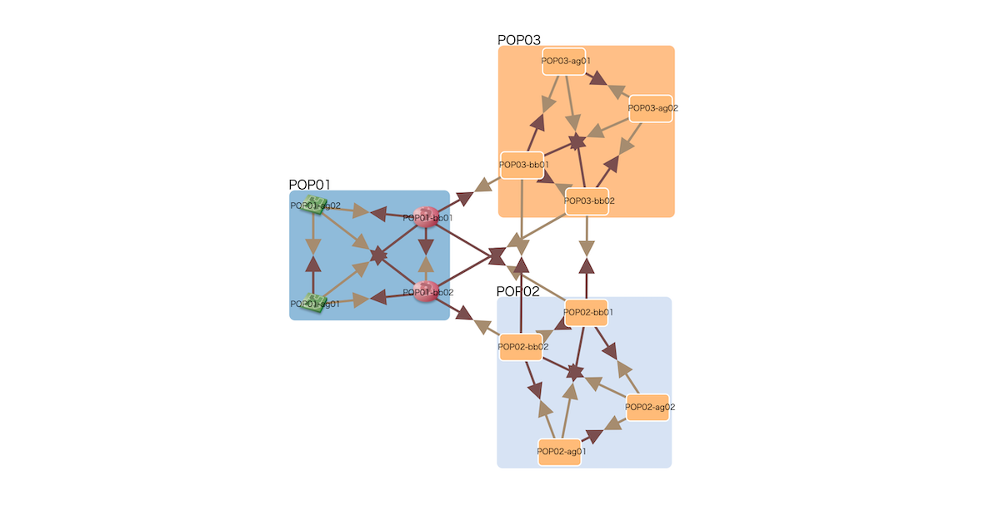

# Arrows Link Plugin

Make links bidirectional arrows.




## Usage

```html
<!DOCTYPE html>
<html>
<head>
  <meta charset="utf-8" />
  <link href="style.css" rel="stylesheet" />
  <script src="https://cdnjs.cloudflare.com/ajax/libs/d3/3.5.17/d3.js"></script>
  <script src="../vendor/cola.min.js"></script>
  <script src="../inet-henge.js"></script>

  <!-- Load plugin.js -->
  <link href="../plugins/arrows_link/style.css" rel="stylesheet" />
  <script src="../plugins/arrows_link/plugin.js"></script>
</head>

<body>
<div id="diagram"></div>
<script>
  // Plug into Diagram before initialization
  Diagram.plugin(ArrowsLinkPlugin);

  const diagram = new Diagram("#diagram", "index.json", { pop: /^([^\s-]+)-/, tooltip: "click" });
  diagram.init("loopback", "interface", "description", "type");
</script>
</body>

</html>
```

:memo: Links in JSON data should be bidirectional.

```js
{
  "nodes": [
    { "name": "POP01-bb01" },
    { "name": "POP01-bb02" }
  ],

  // A unidirectional link results in a unidirectional arrow
  "links": [
    { "source": "POP01-bb01", "target": "POP01-bb02" }
  ]

  // So do this
  "links": [
    { "source": "POP01-bb01", "target": "POP01-bb02" },
    { "source": "POP01-bb02", "target": "POP01-bb01" }
  ]
}
```

:warning: This plugin conflicts with `bundle: true` option.

```js
  const diagram = new Diagram("#diagram", "index.json", {
    // Don't do this
    bundle: true,
  });
```