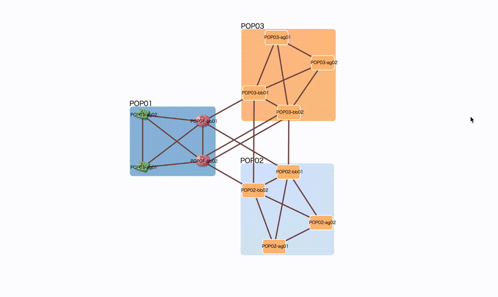

# Removable Node Plugin

Hide and show by key inputs.

1. Click node to select
2. Hit "d" to hide selected nodes
3. Hit "escape" to show hidden nodes




## Usage

```html
<!DOCTYPE html>
<html>
<head>
  <meta charset="utf-8" />
  <link href="style.css" rel="stylesheet" />
  <script src="https://cdnjs.cloudflare.com/ajax/libs/d3/3.5.17/d3.js"></script>
  <script src="../vendor/cola.min.js"></script>
  <script src="../inet-henge.js"></script>

  <!-- Load plugin.js -->
  <script src="../plugins/removable_node/plugin.js"></script>
</head>

<body>
<div id="diagram"></div>
<script>
  // Plug into Diagram before initialization
  Diagram.plugin(RemovableNodePlugin);

  const diagram = new Diagram("#diagram", "index.json", { pop: /^([^\s-]+)-/, bundle: true, tooltip: "click" });
  diagram.init("loopback", "interface", "description", "type");
</script>
</body>

</html>
```


## Customize keybinds

You can customize keybinds like this:

```js
  Diagram.plugin(RemovableNodePlugin, {
    showKey: "s",
    hideKey: "h",
  });
```
